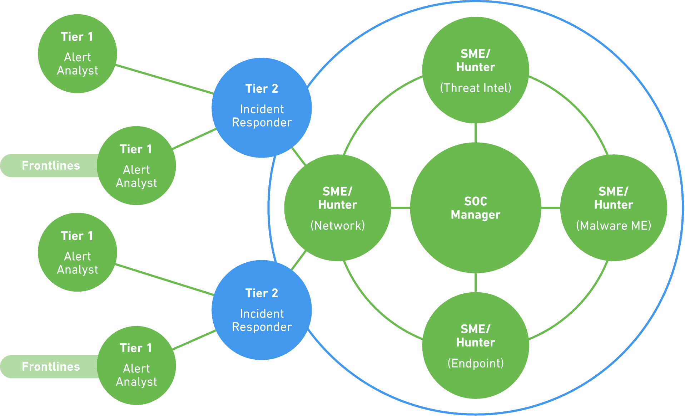

# Day 2 - ISCM with Nagios

* [SOC Quick Start Guide](https://www.exabeam.com/security-operations-center/security-operations-center-a-quick-start-guide/)
* [Nagios Monitoring Tool](https://www.educba.com/nagios-monitoring-tool/)

> "According to the Ponemon Institute 2018 Cost of Data Breaches study, organizations take 266 days on average to detect a breach, and over a month to contain it."

### SOC
"A **security operations center (SOC)*** is traditionally a physical facility with an organization, which houses an information security team. The team analyzes and monitors the security systems of an organization. The aim of the SOC is to protect the company from security breaches by identifying, analyzing and reacting to cybersecurity threats. SOC teams are made up of management, security analysts, and sometimes security engineers. The SOC works with development and IT operations teams within the company."  SOCs operate around the clock to detect and respond to incidents.

Although a dedicated SOC used to only be found in large companies, increasingly you'll see smaller or hybrid SOC teams in small to mid-sized companies, as the importance of this work grows. Some may contract out, some may employ virtual SOCs, but the work remains the same.

### CSIRT
"A **computer security incident response team or ***CSIRT*****, also called CERT or CIRT, is responsible for receiving, analyzing, and responding to security incidents. CSIRTs can work under SOCs or can stand alone. While the core function of a CSIRT is to minimize and manage damage caused by an incident, the CSIRT does not just deal with the attack itself, they also communicate with clients, executives, and the board."

***SOAR*** - Security orchestration, automation, and response 
***TI*** - Threat intelligence
***SIEM*** - Security information and event management

There are multiple schools of thought as to whether CSIRT and SOC should be the same team or separate. Keeping them the same does blur the lines, but provide more interesting, integrated work for the team. Keeping them separate can allow each team to focus on their core objective(s). 

**SOC team core responsibilities** 
* Maintaining security monitoring tools
* Investigate suspicious activities

**SOC team roles**
* Security analyst
* Security engineer
* SOC manager
* Chief information security officer (CISO)
* Director of incident response

Why is understanding the network important? "SOC teams have visibility into the network environment so the SOC can simplify the tasks of drilling into logs and forensic information for example."

"A SOC may use 20 or more technologies, which can be hard to keep track of and control individually making it important to have a central source and a single platform. A security information and event management platform (SIEM) serves this function in most SOCs." 

### 5 STEPS TO SETTING UP YOUR FIRST SOC
1. Ensure everyone understands what the SOC does
2. Provide Infrastructure for your SOC
3. Find the right people
4. Have an incident response plan ready
5. Defend

### SOC best practices
1. Detect threats through all stages of an attack
2. Investigate all alerts to ensure nothing is overlooked
3. Gather forensic evidence for investigation and remediation

### SOC tools and technologies
* Security information and event management (SIEM)
* Governance, risk and compliance (GRC) systems
* Vulnerability scanners and penetration testing tools
* Intrusion detection systems (IDS), intrusion prevention systems (IPS), and wireless intrusion prevention
* Firewalls and next-generation firewalls (NGFW) which can function as an IPS
* Log management systems (commonly as part of the SIEM)
* Cyber threat intelligence feeds and databases

## Nagios Monitoring Tool

> "Nagios is an open source tool that is widely used to monitor the systems, infrastructure, and networks so that performance bottlenecks can be identified."

"There are mainly four object types like commands, notifications, host groups, contact groups, and services. Different types of network services can be monitored like SMTP, HTTP, POP2, SNMP, NNTP, SSH. FTP and many more networking services."  Nagios can also be used for remote monitoring and can be used to detect both network and server issues. 

***Nagios Features*** 
* Easily manageable
* Manages the logs and database systems
* Informative web interface
* Immediate alerts for network and server issues
* Identify performance bottlenecks
* Automatically fixes issues
* SMTP, HTTP, FTP, POP, SNMP, SSH, and many other network services
* Multi-user synchronous access
* Failover capability and continuous monitoring