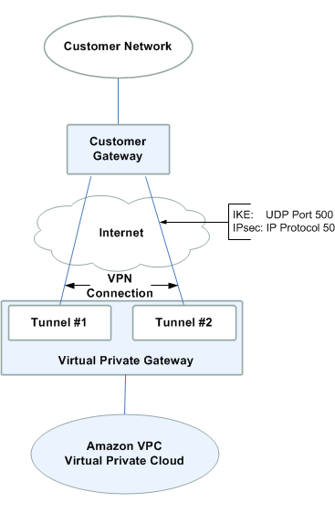

# Day 13 - Cloud Architecture Security
10/21/20

* [Medium Blog: What is a VPC?](https://medium.com/tensult/intro-to-vpc-548b69f1bd1f)
* [AWS: What is a VPC?](https://docs.aws.amazon.com/vpc/latest/userguide/what-is-amazon-vpc.html)

> "A VPC (virtual private cloud) is a virtual data center in the cloud."

### Basics of a VPC
1. Subnets
2. Route Tables (you can have multiple route tables in a VPC)
3. Internet Gateways (IGW) (a horizontally scaled, redundant and highly available VPC component that allows communication between instances and the internet)
4. Network Address Translation (NAT) (NAT maps the private IP addresses to the public address on the way out and vice versa. An Elastic IP address is a static, public IPv4 address designed for dynamic cloud computing. You can associate an Elastic IP address with any instance or network interface for any VPC in your account. With an Elastic IP address, you can mask the failure of an instance by rapidly remapping the address to another instance in your VPC.)
5. Security groups (controls the traffic for your instance)
6. Customer Gateway 
7. Virtual Private Gateway (A virtual private gateway is the VPN concentrator on the Amazon side of the VPN connection) 
8. VPN stands for ‘virtual private networking’
9. VPC Peering (A VPC peering connection allows you to route traffic between two VPC’s using IPv4 or IPv6 private addresses - can help with transfer of data)
10. Network Access Control Lists (NACL)— an optional layer of security for your VPC that acts as a firewall for controlling traffic in and out of one or more subnets

### Additional Resources
* [Hardening Resources in AWS](http://www.nwacc.org/programs/conf17/dispensa_slides.pdf)