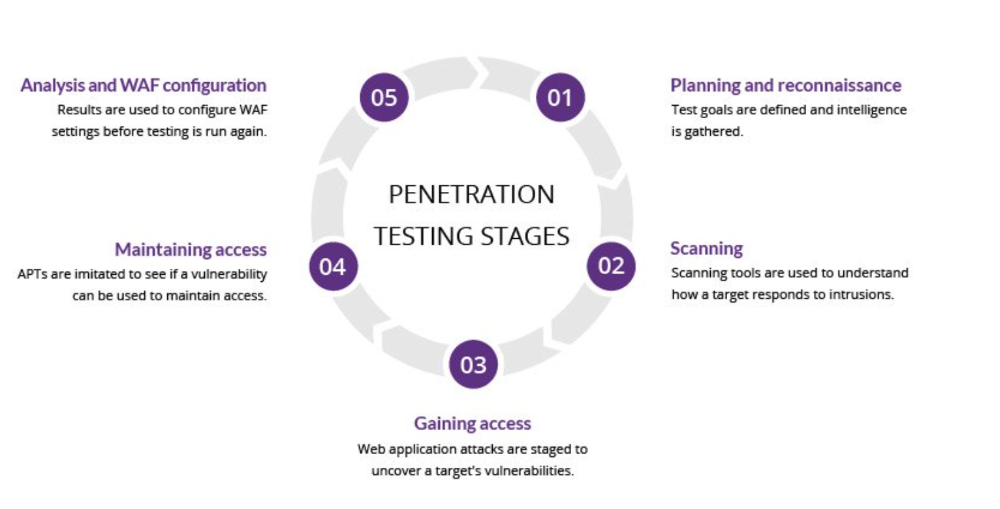

# Day 41 - Reconnaissance
12/1/20

* [What is penetration testing](https://www.imperva.com/learn/application-security/penetration-testing/)

> "A penetration test, also known as a pen test, is a simulated cyber attack against your computer system to check for exploitable vulnerabilities."

Stage 1 - Planning & reconnaissance 
Stage 2 - Scanning 
Stage 3 - Gaining access 
Stage 4 - Maintaining access 
Stage 5 - Analysis & WAF configuration

Pen testing isn't necessarily an "always on" thing, and so you must begin by defining the scope and goals of your test or campaign. Gather intelligence, plot your attack.

Then scan your target, make hypotheses about how it will respond to your attack(s). Inspect the system(s) and/or code in its running status.

Then - attack! See how you can get in and attempt to maintain access.

Finally, the ultimate goal is analysis. What happened? What vulnerabilities were exploited? How could this have been avoided? How can it be avoided *in the future*? This information will be used to strengthen an organization's security and WAF settings.

Methods:
* External testing
* Internal testing
* Blind testing
* Double-blind testing
* Targeted testing

* [Watch hackers break into the US power grid](https://www.youtube.com/watch?v=pL9q2lOZ1Fw&ab_channel=TechInsider)

Wow- this video was incredible. It really highlighted the importance of the human element in security. Doors were left unlocked, the ethical hackers could have taken so many valuable things (iPads, computers, credit cards) and were able to obtain persistent access to the first company's infrastructure via a pretty easy break-in.

In the second case, their reconnaissance uncovered a gap in sensor/camera protection that they were able to exploit. Once inside, they were able to gain access to the internal network. They were also able to copy and make fake badges for continued access. Fascinating stuff.

### Additional Resources
* [An Introduction To Open Source Intelligence (OSINT) Gathering](https://www.secjuice.com/introduction-to-open-source-intelligence-osint/)